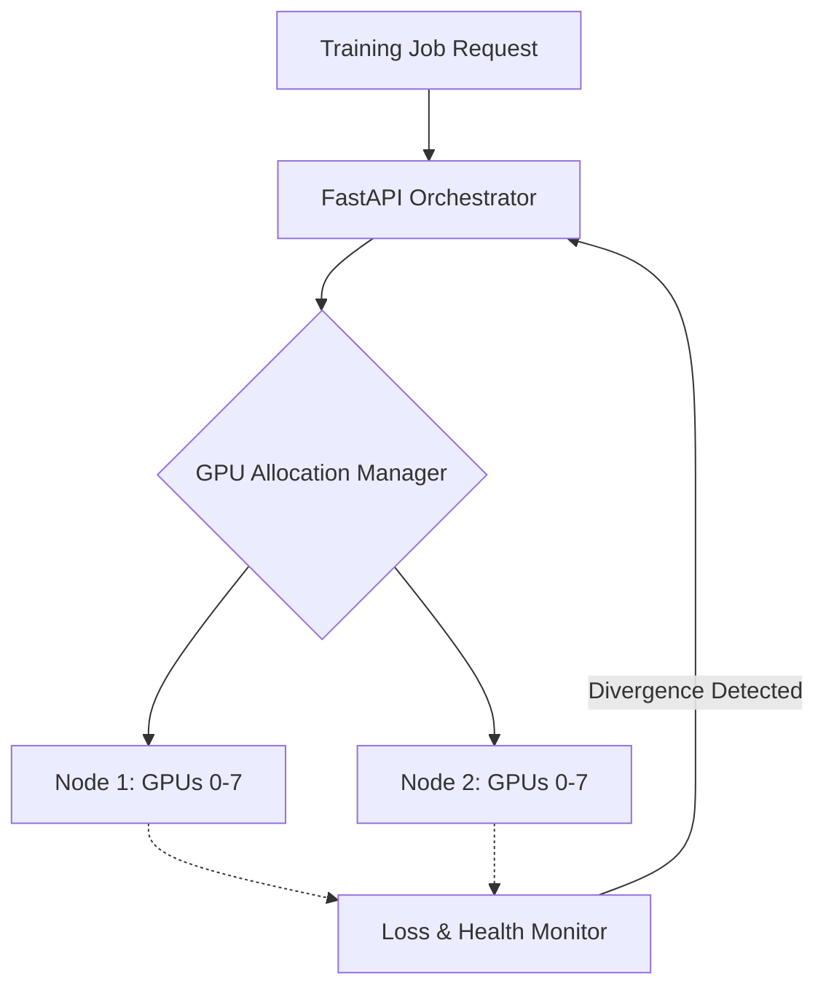

# Distributed LLM Training & GPU Manager


## 📖 Overview
The **Distributed LLM Training & GPU Manager** is an MLOps orchestration suite built to manage DeepSpeed-based distributed training environments. It handles the complexities of multi-node LLM training while deploying background agents that monitor cluster-wide GPU health and detect catastrophic loss spikes to halt/resume corrupted training regimens.

## ✨ Key Features
- **DeepSpeed Orchestration:** Simplified abstractions and auto-configurations for ZeRO Stages 1, 2, and 3.
- **GPU Health Monitoring:** Directly parses `nvidia-smi` to monitor thermals, volatile GPU utilization, and memory fragmentation.
- **Loss Spike Detection:** Statistically detects NaN gradients or diverging loss curves to prevent compute waste.
- **Auto-Resume Capabilities:** Identifies corrupt checkpoints and automatically rolls back to the prior stable state.

## 🏗 System Architecture


## 📂 Repository Structure
- `ai_engine/`: DeepSpeed launcher configurations, loss monitoring heuristics, and GPU memory logic.
- `backend/`: Cluster control APIs.
- `infra/`: Helm charts and container configurations for Kubernetes jobs.

## 🚀 Getting Started

### Local Development
1. Clone the repository and install dependencies:
   ```bash
   pip install -r requirements.txt
   ```
2. Run the MLOps backend orchestrator:
   ```bash
   uvicorn backend.main:app --host 0.0.0.0 --port 8000
   ```
*(Note: Active training requires CUDA-capable GPUs and nvidia-drivers)*

## 🛠 Known Issues
- DeepSpeed launcher needs multi-node configuration tuning for massive clusters.

## 🤝 Contributing
Please submit PRs focusing on extending cluster monitoring capabilities to ROCm/AMD architectures.

## ?? Future Roadmap & Enhancements
- **Spot-Instance Resiliency**
- **Unified web interface replacing nvidia-smi that visualizes NVLink topology constraints**
